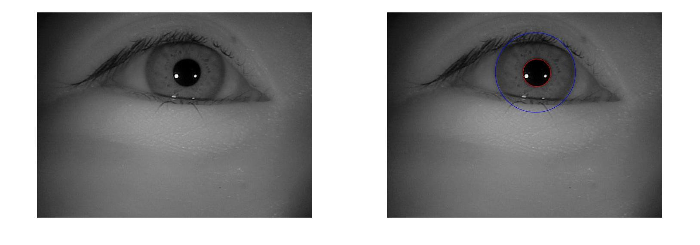
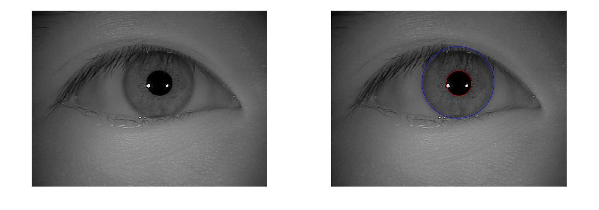
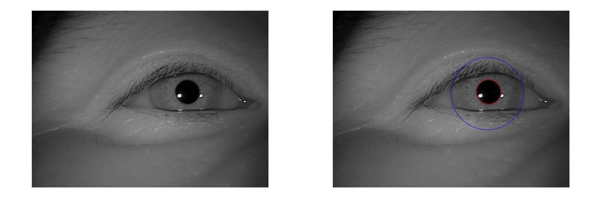
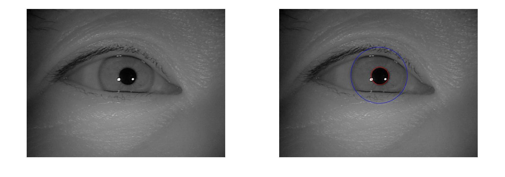
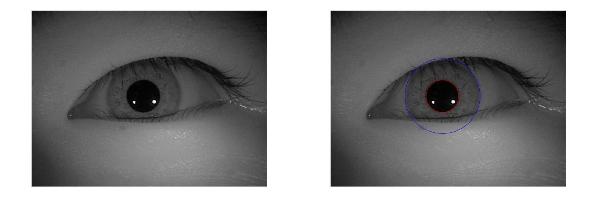
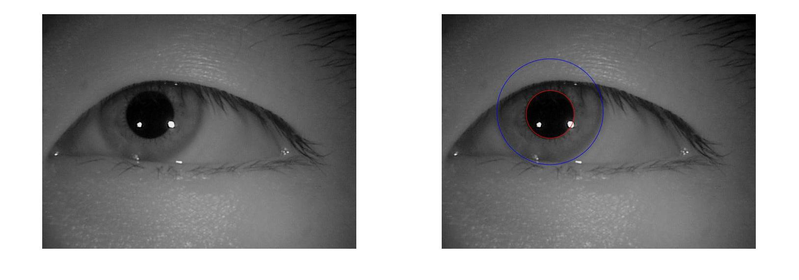
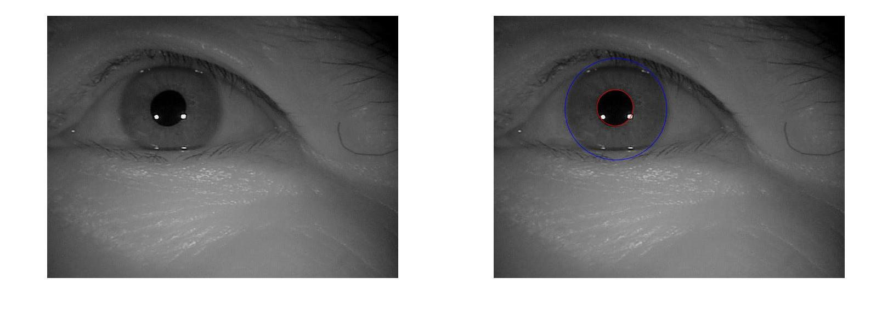
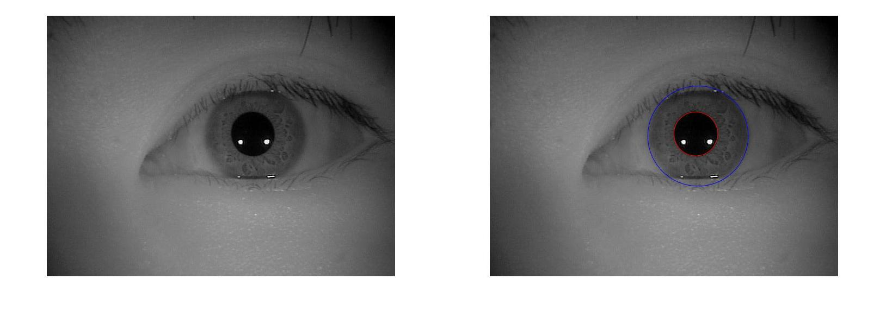
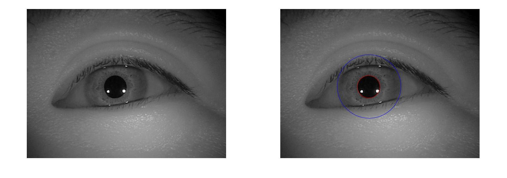
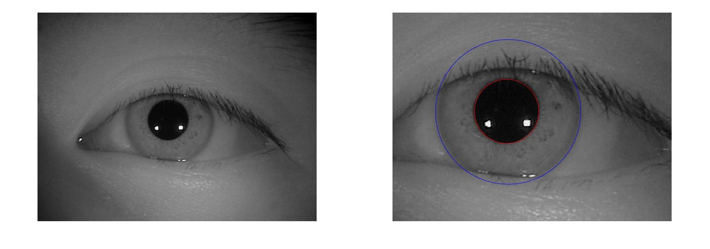

# -Iris-and-pupil-sliced

# 
The program's main purpose is get iris and pupil location. 
So that we can further do things like iris recongition.

# 
The Set_Image_To_Logical.m is implement "Adaptive Thresholding Using the Integral Image". (https://people.scs.carleton.ca/~roth/iit-publications-iti/docs/gerh-50002.pdf)
And we can get the connected area of several parts.
That means that we can choose the max connected part as the pupil part which use function "bwconncomp" from mathworks.

# Example images

